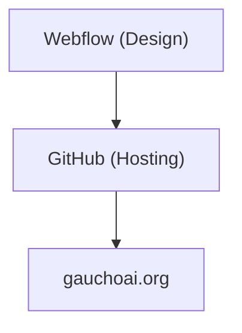
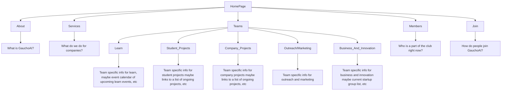

# GauchoAI

This GitHub Repository is the code for the GauchoAI website found [here](https://gauchoai.org).

## Repository Organization:

## Website Organization:

## How to push changes:

1. Export code from webflow.
2. Drag and drop all webflow files into the GauchoAI repo. If it prompts to replace files say yes.
3. Push changes and PR.
4. Let GitHub Actions re-publish the site.
