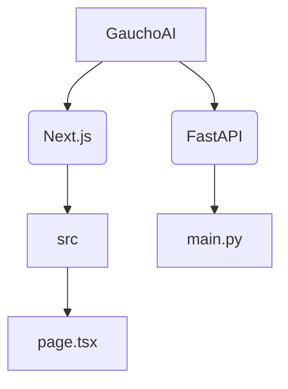

# GauchoAI

This GitHub Repository is the code for the GauchoAI website found [here]().

## To-do:

- [ ] Work on setting up the home page for now
- [ ] Take a look at [ACM](https://www.ucsbacm.com/) and [BruinAI](https://bruinai.org/) sites, get inspiration, and figure out what I want this site to look like
- [ ] Create some placeholder pages for the pages I want

## Repository Organization:



## Website Organization:

```mermaid
graph TD;
    HomePage-->About-->()
    HomePage-->Services-->(What do we do for companies?);
    HomePage-->Teams;
    Teams-->Learn(Team specific info for learn, maybe event calendar of upcoming learn events, etc);
    Teams-->Student_Projects-->(Team specific info for student projects maybe links to a list of ongoing projects, etc);
    Teams-->Company_Projects-->(Team specific info for company projects maybe links to a list of ongoing projects, etc);
    Teams-->Outreach/Marketing-->(Team specific info for outreach and marketing);
    Teams-->Business_And_Innovation-->(Team specific info for business and innovation maybe current startup group list, etc);
    HomePage-->Members-->(Who is a part of the club right now?);
    HomePage-->Join-->(How do people join GauchoAI?);
```
