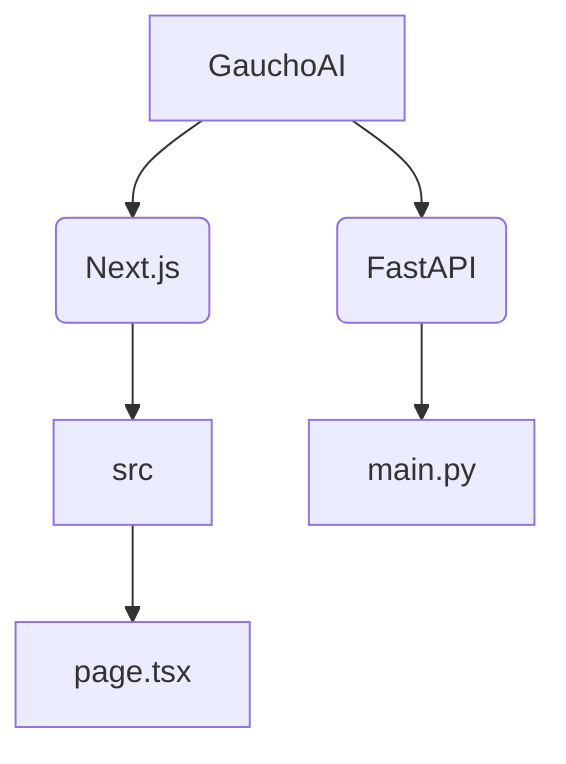

# GauchoAI

This GitHub Repository is the code for the GauchoAI website found [here]().

## To-do:

- [ ] Work on setting up the home page for now
- [ ] Take a look at [ACM](https://www.ucsbacm.com/) and [BruinAI](https://bruinai.org/) sites, get inspiration, and figure out what I want this site to look like
- [ ] Create some placeholder pages for the pages I want

## Repository Organization:

## Website Organization:

